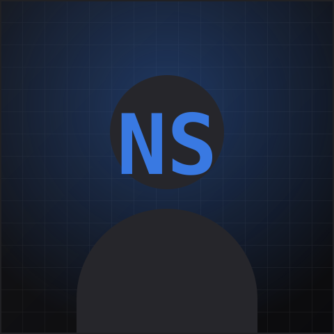

# Portfolio — Nima Saghi

A modern, dark, terminal/IDE-inspired developer portfolio. Built with **Next.js 16 (App Router)**, **TypeScript**, **Tailwind CSS v4**, and **Framer Motion**. Polished, responsive, accessible, and fast — with all content driven by a single config file so you can make it yours without touching component code.



---

## ✨ Features

- **Sections**: Hero (typewriter + live "terminal" card), About (animated stat counters), Skills, Projects (3D-tilt cards + detail modal), Experience (scroll-drawn timeline), Contact (working form), Footer.
- **Motion**: page-load stagger, scroll reveals, magnetic hover states, cursor-tracking glows — all respecting `prefers-reduced-motion`.
- **Responsive**: mobile-first, with an animated slide-in mobile menu.
- **Accessible**: semantic HTML, ARIA labels, keyboard-navigable, visible focus rings, color contrast.
- **SEO**: metadata + Open Graph, a generated OG share image, `sitemap.xml`, and `robots.txt`.
- **Contact API**: validated Next.js route handler with a spam honeypot — ready to wire to a real email provider.
- **One-file customization**: everything lives in [`data/portfolio.ts`](data/portfolio.ts).

## 🧱 Tech Stack

| Concern      | Choice                                  |
| ------------ | --------------------------------------- |
| Framework    | Next.js 16 (App Router, Turbopack)      |
| Language     | TypeScript                              |
| Styling      | Tailwind CSS v4 (CSS-first `@theme`)    |
| Animation    | Framer Motion (`motion` package)        |
| Icons        | lucide-react (+ local brand SVGs)       |
| Fonts        | Geist Sans + JetBrains Mono (`next/font`) |
| Deploy       | Vercel-ready (portable)                 |

---

## 🚀 Getting Started

Requires **Node.js 20.9+**.

```bash
npm install
npm run dev
```

Open [http://localhost:3000](http://localhost:3000).

Other scripts:

```bash
npm run build   # production build (also type-checks)
npm run start   # serve the production build
npm run lint    # eslint
```

---

## 🎨 Customize your content

**Edit one file: [`data/portfolio.ts`](data/portfolio.ts).** Placeholders that need your real content are marked with `🔧`. It controls:

- `site` — your name, handle, roles (cycled in the hero typewriter), tagline, email, location, resume path, and production URL (used for SEO).
- `nav` — nav items (each `id` must match a `<section id="…">`).
- `about` — bio paragraphs, avatar path, and the animated stats.
- `skills` — categories and the skills within them (with hover tooltips).
- `projects` — your projects (title, summary, long description, tags, links, cover accent colors).
- `experience` — your timeline entries.
- `socials` — your social links.

Change the site's **look** (colors, fonts) in [`app/globals.css`](app/globals.css) — all design tokens live in the `@theme` block at the top. The single accent color is `--color-accent`.

### Swap the placeholder assets

- **Avatar**: replace [`public/avatar.svg`](public/avatar.svg) with your photo (e.g. `public/avatar.jpg`) and update `about.avatar` in the data file. If you use a raster image, you can drop the `unoptimized` prop on the `next/image` in [`components/sections/About.tsx`](components/sections/About.tsx) to get automatic optimization.
- **Resume**: replace [`public/resume.pdf`](public/resume.pdf) with your real résumé.
- **Project images (optional)**: cards use a generated gradient cover by default. To use real screenshots, add an `image` field to a project in the data file and render it with `next/image` in [`components/projects/ProjectCard.tsx`](components/projects/ProjectCard.tsx).
- **Favicon**: replace [`app/favicon.ico`](app/favicon.ico).

---

## 📬 Contact form — hooking up real email

Out of the box, submissions are **validated and logged on the server** (check your terminal). No message is actually emailed yet. To deliver mail, wire up a provider in [`app/api/contact/route.ts`](app/api/contact/route.ts) — the recommended path is [Resend](https://resend.com):

1. `npm install resend`
2. Create `.env.local`:
   ```bash
   RESEND_API_KEY=your_key_here
   CONTACT_TO_EMAIL=you@example.com
   ```
3. Uncomment the block marked `SEND EMAIL` in the route handler.

Secrets are read from environment variables — **nothing is hard-coded**. On Vercel, add the same variables under Project → Settings → Environment Variables.

---

## 📁 Project structure

```
app/
  layout.tsx          # fonts, metadata/SEO, providers
  page.tsx            # composes the sections
  globals.css         # design tokens (@theme) + base styles + utilities
  opengraph-image.tsx # generated social share image
  sitemap.ts / robots.ts
  api/contact/route.ts

components/
  Nav.tsx  Footer.tsx
  sections/           # Hero, About, Skills, Projects, Experience, Contact
  projects/           # ProjectsGrid, ProjectCard, ProjectModal
  contact/            # ContactForm, CopyButton
  icons/              # brand SVGs (GitHub / LinkedIn / X)
  ui/                 # Button, Tag, SectionHeading, Reveal, Counter,
                      #   TiltCard, Typewriter, TerminalCard, HeroBackground, BackToTop

data/portfolio.ts     # 👈 all content lives here
lib/                   # utils (cn), motion variants, hooks
public/                # avatar.svg, resume.pdf, favicon
```

---

## ♿ Accessibility & performance notes

- All animation respects `prefers-reduced-motion` (via `MotionConfig`, a CSS fallback, and per-component guards).
- Fonts are self-hosted through `next/font` (no layout shift, no external requests).
- Keyboard navigable with visible focus states; the mobile menu and project modal trap focus and close on `Escape`.
- A `<noscript>` fallback reveals all scroll-animated content when JavaScript is disabled.
- Measure real performance with [Lighthouse](https://developer.chrome.com/docs/lighthouse/overview) against a production build (`npm run build && npm run start`).

---

## ▲ Deploy to Vercel

1. Push this repo to GitHub.
2. Import it at [vercel.com/new](https://vercel.com/new) — Vercel auto-detects Next.js; no config needed.
3. Add any environment variables (e.g. `RESEND_API_KEY`, `CONTACT_TO_EMAIL`).
4. Set `site.url` in [`data/portfolio.ts`](data/portfolio.ts) to your production domain so SEO, Open Graph, and the sitemap use the right URL.
5. Deploy.

> **Heads up (local dev):** this project lives inside a OneDrive-synced folder. `node_modules` can be slow to sync or occasionally locked. If dev/builds feel sluggish, pause OneDrive sync or move the project outside the synced directory.

---

Built from scratch — not a template. Make it yours.
